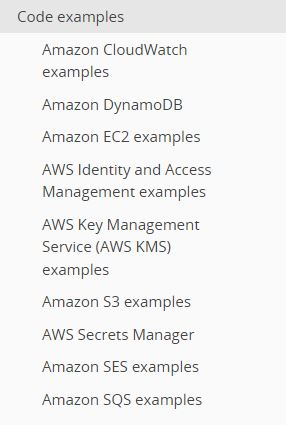
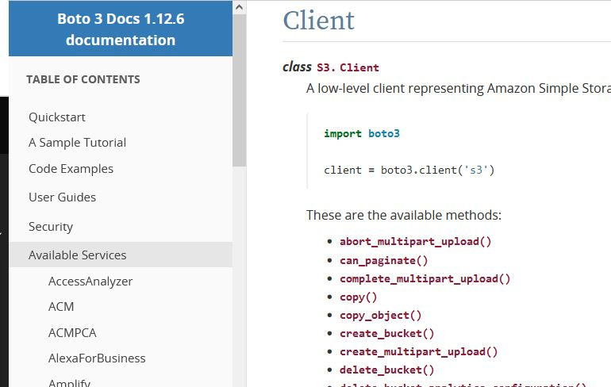

### What is Boto3?

Boto3 makes it easy to integrate your Python application, library, or script with AWS services including Amazon S3, Amazon EC2, Amazon DynamoDB, and more.

### Install boto3
```
pip install boto3
```

### References / Examples 
- https://boto3.amazonaws.com/v1/documentation/api/latest/guide/quickstart.html

 

Class and functions are in "Available Services" tab.

 
