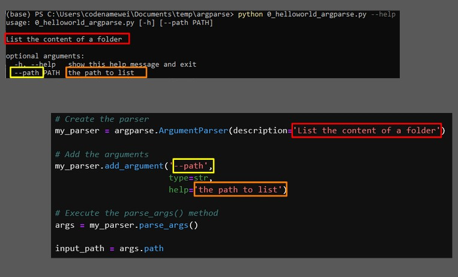
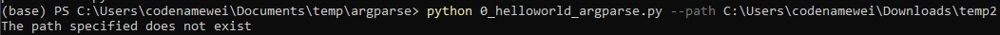

## Passing argument into python script

### [Unnamed argument](sysarg.py)


### Argparse

#### Named argument with library _argparse
    - 0_helloworld_argparse.py
    ```
    python 0_helloworld_argparse.py --path C:\Users\codenamewei\Downloads\temp2
    ```
    
    
    

#### [File argument with library _argparse_](fileargparser.py)


#### Using the Python argparse library has four steps:

- Import the Python argparse library ```pip install argparse```
- Create the parser
- Add optional and positional arguments to the parser
- Execute .parse_args()
    - After you execute .parse_args(), what you get is a [Namespace object](https://docs.python.org/dev/library/argparse.html#argparse.Namespace) that contains a simple property for each input argument received from the command line.
    
- Use --help    
  ```python .\0_helloworld_argparse.py --help```
  

