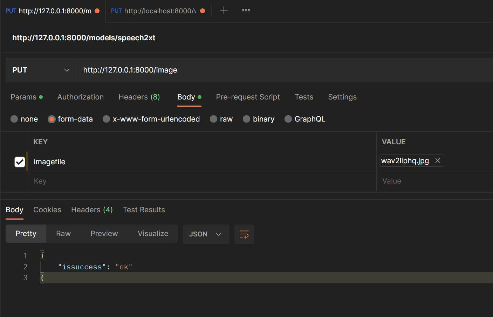
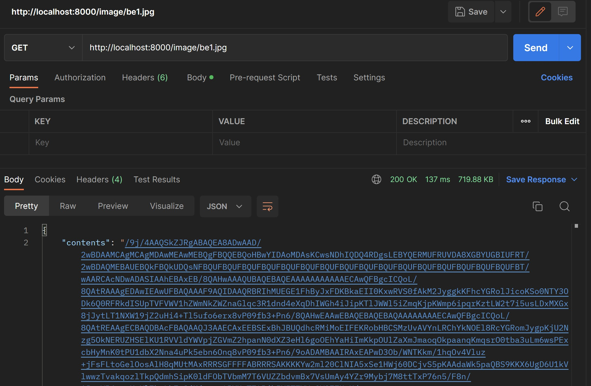

### Prerequisite

1. Server Started with `server.py`

2. Postgres Setup

### How to run

0. [Only for once: Create table](createtable.ipynb)

1. Save image with methods below
    - Upload through page
    - Provide with Postman
    

    - Upload through endpoint with python script

2. Retrieve image with  
    - Provide with Postman  
      
     
    - [Retrieve through endpoint with python script](client.ipynb)

### Test
- `nativesaveimage.ipynb` saves image into postgres
