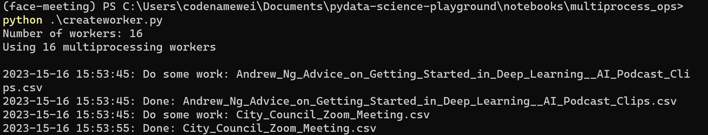

### Notes

- Number of worker are of number of cores
- Main process should be in the loop of `if __name__ == "__main__"` to prevent errors
  
- Seems not to work on notebooks `.ipynb`
- Read more about `pool.imap` at [here](https://superfastpython.com/multiprocessing-pool-imap/)
